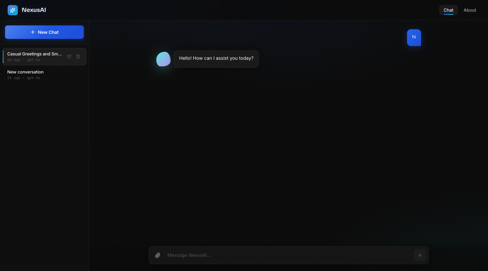
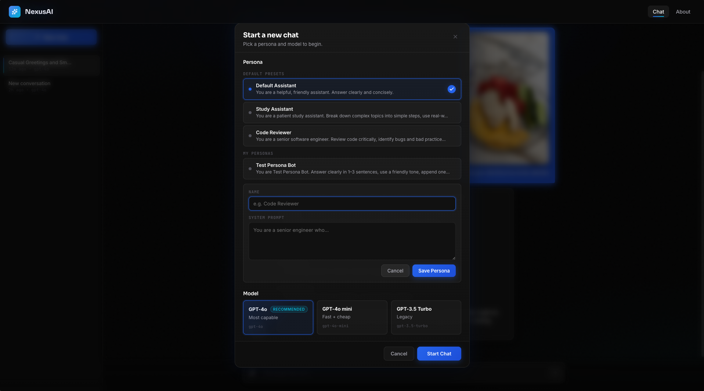
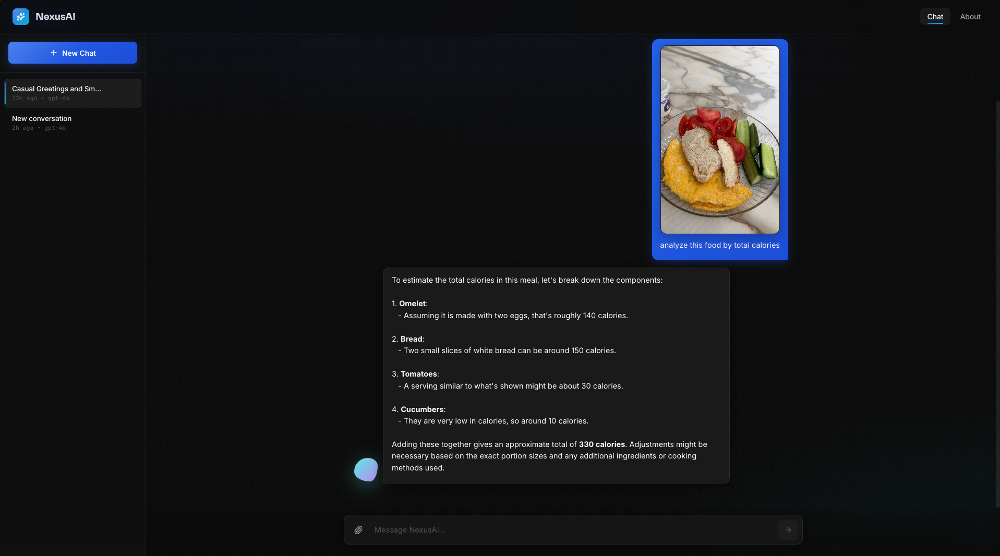

# Morphi

<p align="center">
  
</p>

<p align="center">
  <strong>A premium full-stack AI chat workspace with personas, model selection, file understanding, and a polished dark interface.</strong>
</p>

<p align="center">
  
  
  
  
</p>

---

## Overview

Morphi is an AI chat application built as a full-stack GenAI project. It combines a refined React + TypeScript frontend with a Python API backend, persistent conversations, configurable assistant personas, OpenAI-powered responses, and support for text, image, PDF, and voice workflows.

The product experience is intentionally close to a modern premium AI workspace: dark glass surfaces, focused navigation, persistent chat history, animated empty states, streamed assistant replies, and a flexible new-chat modal for users who want to choose a persona and model before starting.

## Product Preview

### AI Conversation


### Persona + Model Setup



### Image Analysis



## Highlights

- **Chat-first UX**: users can type immediately; Morphi creates a default conversation silently when needed.
- **Persona system**: choose built-in personas or create a custom one with a dedicated system prompt.
- **Model selection**: start a conversation with GPT-4o, GPT-4o mini, or GPT-3.5 Turbo.
- **Streaming responses**: text replies render progressively for a faster, more natural experience.
- **Multimodal input**: send text, images, PDFs, and voice files.
- **Persistent conversations**: chat history appears in the sidebar with archive and delete actions.
- **Generated titles**: conversations can be named automatically from the message context.
- **Premium UI**: glass panels, subtle motion, dark gradients, responsive layout, and lucide icons.

## Tech Stack

| Layer | Technology |
| --- | --- |
| Frontend | React 19, TypeScript, Vite |
| Styling | CSS modules by component, custom dark theme |
| Icons | lucide-react |
| HTTP | Axios |
| Routing | React Router |
| Backend | Python, FastAPI, Uvicorn |
| AI | OpenAI chat completions, Whisper transcription, image analysis |
| Database | MySQL via SQLAlchemy models |

## Project Structure

```text
Frontend/
├── src/
│   ├── Components/
│   │   ├── ChatArea/
│   │   │   ├── ChatWindow/
│   │   │   ├── MessageBubble/
│   │   │   ├── MessageInput/
│   │   │   ├── ModelSelector/
│   │   │   ├── NewChatModal/
│   │   │   ├── PersonaSelector/
│   │   │   └── Sidebar/
│   │   ├── LayoutArea/
│   │   └── PagesArea/
│   ├── Models/
│   ├── Services/
│   ├── Utils/
│   └── assets/Screenshots/
├── index.html
└── package.json
```

## Getting Started

### Prerequisites

- Node.js 20+
- npm
- Python 3.11+
- MySQL
- OpenAI API key

### Frontend

```bash
cd Frontend
npm install
npm run dev
```

Open:

```text
http://127.0.0.1:5173/
```

### Backend

From the project root:

```bash
cd Backend
python -m venv venv
source venv/bin/activate
pip install -r requirements.txt
cd src
python app.py
```

Backend default:

```text
http://127.0.0.1:4000/
```

## Environment

Create a backend `.env` file with the values required by your local database and OpenAI setup. The backend already expects local configuration for database access and OpenAI usage.

Common values include:

```env
OPENAI_API_KEY=your_api_key
MYSQL_HOST=localhost
MYSQL_USER=root
MYSQL_PASSWORD=your_password
MYSQL_DATABASE=your_database
```

Adjust names to match the backend configuration in your local environment.

## Scripts

| Command | Description |
| --- | --- |
| `npm run dev` | Start the Vite development server |
| `npm run build` | Type-check and build the frontend |
| `npm run lint` | Run ESLint |
| `npm run preview` | Preview the production build |

## Core Experience

Morphi supports two ways to start a chat:

1. Type directly into the message box and Morphi creates a default GPT-4o conversation automatically.
2. Click **New Chat** to choose a persona and model manually.

That split keeps the app fast for casual use while preserving advanced control for configured sessions.

## Author

Built by **Daniel Machluf** as a full-stack AI project.

GitHub Repository: [https://github.com/DanielMachluf/Morphi](https://github.com/DanielMachluf/Morphi)
